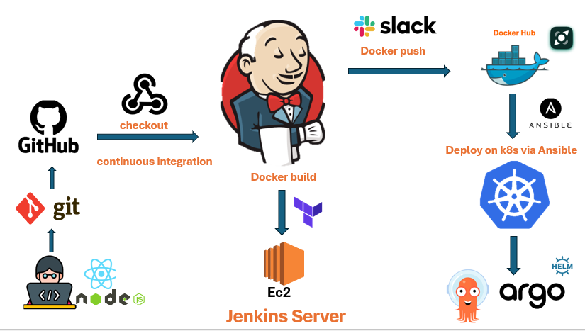

# Frontend and Backend Project

## Tools


## Overview
This project is a full-stack application that integrates frontend and backend components using various DevOps tools and best practices for deployment, orchestration, and automation. The goal is to streamline development and operations while leveraging cloud services for scalability.

## Tools & Technologies
The following tools are used to manage, deploy, and monitor this project:

- **Docker**: Containerization of applications for consistent and reproducible environments.  
- **Jenkins**: CI/CD pipeline automation to build, test, and deploy the project.  
- **Ansible**: Configuration management and automation to provision infrastructure and manage application settings.  
- **Terraform**: Infrastructure as Code (IaC) for provisioning and managing cloud resources on AWS.  
- **Kubernetes**: Orchestration of Docker containers for scalable application deployment and management.  
- **AWS**: Cloud infrastructure provider, hosting the application and related services.  
- **ArgoCD**: GitOps continuous delivery tool for Kubernetes deployments from Git repositories.  
- **Prometheus**: Monitoring tool used to collect metrics from services and infrastructure.  
- **Grafana**: Visualization tool used to create dashboards from Prometheus metrics.  
- **Slack**: Integrated notifications for monitoring and alerts during the CI/CD process and infrastructure changes.  


## Project Structure
- **Frontend**: The UI part of the application built using modern web technologies.
- **Backend**: The API and business logic layers, handling data storage, retrieval, and user authentication.

├── frontend/ # Frontend application source code

├── backend/ # Backend API and business logic

├── terraform/ # Terraform infrastructure code (AWS resources)

├── ansible/ # Ansible playbooks for provisioning

├── kubernetes/ # Kubernetes manifests

├── argocd/ # ArgoCD application definitions

├── docker-compose.yml

├── jenkinsfile # Jenkins pipeline configuration

└── README.md

## Infrastructure
1. **Docker** is used to containerize both frontend and backend applications for easier environment consistency.
2. **Terraform** provisions necessary AWS resources such as EC2 instances, S3 buckets, and more.
3. **Ansible** is used to configure servers and deploy the necessary software on them.
4. **Kubernetes** manages the Docker containers, ensuring scalability and resilience across multiple nodes.

## CI/CD Pipeline
- **Jenkins** automates the build, test, and deployment stages for both frontend and backend applications.  
- Docker images are built and pushed to a container registry.  
- **Terraform** provisions infrastructure like EC2, VPCs, and S3 buckets on AWS.  
- **Ansible** configures servers and installs required services.  
- **Slack** alerts are triggered for job notifications and deployment status.  
- **ArgoCD** pulls Kubernetes manifests from Git and deploys them to the cluster in a GitOps style.

## 📊 Monitoring & Observability

Monitoring is implemented using Prometheus and Grafana:

- **Prometheus**
- **Grafana** 

## 🚀 Deployment Strategy

This project follows a **GitOps** deployment model using **ArgoCD**:

- Kubernetes manifests are stored in Git.
- ArgoCD continuously syncs application state from Git to the live cluster.
- Rollbacks and version control of deployments are managed through Git history.

## 🧭 Getting Started

1. Clone the repository  
   ```bash
   git clone https://github.com/Emanabdelhamid241/final-project-DevOps-DEPI.git

2. Use Terraform to provision AWS infrastructure  
3. Use Ansible to configure the environment  
4. Use Jenkins to trigger CI/CD pipeline  
5. ArgoCD will manage app deployment into Kubernetes  
6. Access Grafana dashboards for real-time metrics


## 📬 Contact

**Eman Abdelhamed**  
DevOps Engineer 

emanabdelhami126@gmail.com